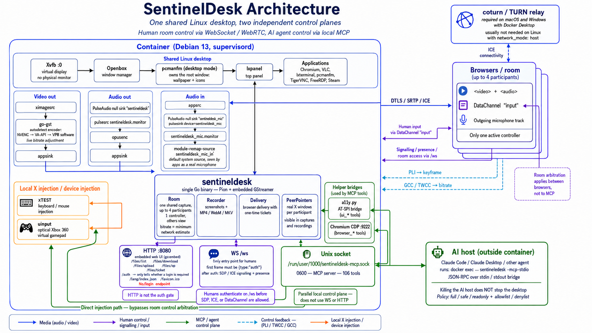

# SentinelDesk — a collaborative operating system for people and AI agents

**Project site: <https://lordbasex.github.io/sentineldesk/docs/index.html>** —
this material laid out as a site, with the architecture and installation pages
and the full [user guide](https://lordbasex.github.io/sentineldesk/docs/guide/index.html),
in English, Spanish and Portuguese. It is where the **Docs** button in the
desktop's rail goes.



A complete Linux desktop running **inside a Docker container with no physical
monitor**, streamed to the browser over **WebRTC** — and driven, at the same
time, by people and by an AI agent that sees and acts on the same screen.

That second half is not a metaphor for an API. It is the same X display, the
same session, the same room:

- **The agent is a participant**, not a background process. It has a name in the
  list and a pointer on screen in its own colour, so it is never ambiguous
  whether a colleague or the model just moved the mouse.
- **They take turns.** Control is claimed, never assumed — by anybody, including
  the agent, and whether or not somebody is watching. Nobody holds the controls
  until they ask for them, so a person who joined to watch a colleague work is
  never handed a desktop they did not want. When somebody is driving, asking puts
  a prompt on their screen with a timer, and no answer means no.
- **They read the same state.** Every command run in a terminal reports its exit
  status, whoever ran it — so a person can hit an error, ask the agent to look,
  and the agent reads what actually happened instead of being told about it.
- **One capture, many observers.** The desktop is encoded once and fanned out:
  to every browser, to the recorder, to a live stream. A second participant
  costs bandwidth, not CPU.

People drive it through a control layer in the browser. The agent drives it
through a local Unix socket with **119 MCP tools**. Neither is a guest of the
other.

The backend is **a single Go binary** (Pion WebRTC + go-gst): GStreamer runs
inside the process, every RTP packet goes from `appsink` straight to the WebRTC
track, and the encoder stays under full control at runtime.

## What is in it

| Layer | What it uses |
|---|---|
| Desktop | Xvfb, Openbox, LXPanel, pcmanfm; Chromium, VLC, lxterminal, TigerVNC, FreeRDP — see [docs/packages.md](docs/packages.md) |
| Capture | `ximagesrc` with X DAMAGE tracking, one shared pipeline |
| Video | NVENC → VA-API → x264 → VP8, chosen by a real probe at startup |
| Audio | PulseAudio null sink → `opusenc`; a remapped source so the browser's microphone appears as a real input device |
| Transport | Pion WebRTC v4, GCC congestion control over TWCC, PLI keyframes, NACK, Opus in-band FEC |
| Human control | WebSocket signalling + DataChannel, XTEST injection, XFixes cursors, XShape peer pointers, EWMH |
| Agent control | MCP over a `0600` Unix socket, 119 tools, each classified by risk |
| Reading the screen | AT-SPI accessibility tree, Chrome DevTools Protocol — structure, not pixels |
| Web UI | `go:embed`, served with content ETags |

## What each side can do

**From the rail, a person can**: take and release control, send their
microphone into the desktop, take screenshots and record to MP4/WebM/MKV,
[stream the session out](#streaming-the-desktop-out) to YouTube/Twitch/Facebook
or to their own VLC/OBS, move files both ways with a two-pane manager or by
dropping them on the page, share the clipboard, use a gamepad, watch live
statistics, and read the [documentation](#documentation) in three languages.

**Through MCP, an agent can**: move the mouse and type; manage windows,
desktops and processes; launch applications and run commands; open a terminal
the person can watch and read back what happened, including exit codes; read
the screen as an accessibility tree or as text; drive Chromium through DevTools;
read and write files; install packages; open shells and SSH sessions with
tunnels; take screenshots and recordings; start and stop external streams; take
snapshots it can roll back to; and ask the room for its turn.

## Performance

- **Automatic hardware encoder**: at start it tries NVENC (NVIDIA) → VA-API
  (Intel/AMD) → software VP8, with a real probe pipeline. Force it with
  `ENCODER=nvenc|vaapi|h264|vp8`.
- **Keyframes on demand (PLI/FIR)**: when the browser loses its reference frame,
  the encoder answers with an immediate keyframe instead of waiting for the GOP.
- **Adaptive bitrate**: GCC congestion estimation over TWCC — the same technique
  Google Meet uses; the encoder's bitrate follows what the network actually
  gives.
- **Minimal jitter buffer** (`jitterBufferTarget=0`): latency over smoothness.
- **Local cursor**: the pointer is drawn on the client, so perceived latency is
  about zero; `REMOTE_CURSOR=1` goes back to the server's pointer.
- **NACK retransmission and in-band FEC on audio** (Pion interceptors + Opus).

Typical measured latency: **~50-70 ms** glass-to-glass on a LAN, plus the RTT to
the server.

## Architecture

One shared Linux desktop, reached through **two independent control planes**.
That separation is the single most important thing to understand about this
project, so the rest of this section is organised around it.

### The desktop

`Xvfb :0` provides a virtual display with no physical monitor behind it.
`Openbox` manages window frames and nothing else — it does not draw the desktop
itself. That job belongs to `pcmanfm` in desktop mode, which owns the root window
and paints the wallpaper and icons, with `lxpanel` on top. Everything runs under
supervisord, so any piece can be restarted independently.

### The media path (outbound)

**Video.** `ximagesrc` reads the framebuffer and hands it to GStreamer, which
runs *inside* the Go process through go-gst rather than as a separate `gst-launch`
child. That is true of the live pipeline everyone is watching; the side pipelines
— recording, screenshots, the roomless restream fallback — are separate processes
on purpose, so that a bad codec combination or a full disk ends one file rather
than the desktop. The encoder is chosen at startup by running a real probe pipeline for each
candidate in turn — **NVENC → VA-API → x264 → software VP8** — so the choice
reflects what actually works on this host, not what the drivers claim. Encoded
frames leave through an `appsink` and each RTP packet goes straight onto the
Pion track.

On the H.264 encoders the frames pass through a `tee` on the way out. Nothing is
attached to it in the normal case; it is where an external destination gets a
copy of the picture the room is already receiving, so streaming to YouTube or to
a VLC on the next desk does not mean encoding the screen a second time.

**Audio.** There is no sound card, so PulseAudio loads a null sink named
`sentineldesk`. Applications play into it, and `pulsesrc sentineldesk.monitor`
captures what they played. `opusenc` encodes it and a second `appsink` feeds the
audio track.

Both paths stay under live control: a PLI from the browser produces an immediate
keyframe instead of waiting for the next GOP, and GCC congestion estimation over
TWCC adjusts the encoder's bitrate to what the network is actually delivering.

### The media path (inbound)

The browser's microphone travels the other way, and the return path needs two
PulseAudio objects rather than one:

```
incoming Opus track → appsrc → pulsesink device=sentineldesk_mic
                             → null sink "sentineldesk_mic"
                               → sentineldesk_mic.monitor
                                 → module-remap-source "sentineldesk_mic_in"
```

The remap is not decoration. A monitor is how PulseAudio exposes "what a sink is
playing", and applications treat it as such: browsers list monitors separately
from real inputs, or hide them from the microphone picker altogether. Remapped,
the same audio presents as an ordinary capture device — and it is made the system
default, so a page calling `getUserMedia` with no explicit device gets the person
talking rather than the desktop's own loudspeakers.

Both objects are created at startup, not on first use. A page enumerates its
audio devices when it loads, so a microphone that appears later is missing from
the list of the very page that wanted it.

### Control plane 1 — humans, over WebSocket

`WS /ws` is the **only entry point for humans**. The first frame must be
`{type:"auth"}`; until it validates there is no SDP offer, no ICE, no
DataChannel. After authentication the same socket carries signalling and presence.

`HTTP :8080` serves the embedded web client (`go:embed`) and the file manager
endpoints, and holds **no secrets**: the ICE configuration and TURN credentials
travel over the authenticated WebSocket. The only informational endpoint is
`/auth`, which says nothing beyond whether a login is required. **There is no
`/login` endpoint, by design** — HTTP is not the authentication gate.

Keyboard and mouse arrive over a DataChannel named `input` and are injected into
X through XTEST. A browser gamepad becomes a virtual Xbox 360 pad through uinput,
where the host exposes `/dev/uinput`.

### Control plane 2 — the AI agent, over a local Unix socket

The MCP server listens on `/run/user/1000/sentineldesk-mcp.sock`, mode `0600`,
and exposes **119 tools**. (In the container that path is fixed; a native
install puts the desktop's user on whatever uid is free, so the socket follows
it — `grep MCP_SOCK /etc/sentineldesk/env`.) The AI host — Claude Code, Claude Desktop, or any
other agent — spawns `sentineldesk -mcp-stdio` with `docker exec`; that
sub-command is a thin JSON-RPC pipe between stdin/stdout and the socket. Killing
the AI host therefore never takes the desktop down with it.

Two helper bridges exist for the tools that need more than pixels: `a11y.py`
exposes the AT-SPI accessibility tree (the `ui_*` tools, which invoke a button by
name rather than by coordinates), and Chromium runs with CDP on port 9222 (the
`browser_*` tools, which drive the real DOM).

What the agent may do is bounded by a three-level policy — `full`, `safe`,
`readonly` — plus a denylist and an allowlist. The daemon sets the ceiling
through the environment, and each connection can restrict itself further but
never widen.

### The room, and one deliberate asymmetry

Capture happens **once** and is fanned out to up to four participants
(`MAX_VIEWERS`), so a second viewer does not cost a second encoder. One person
drives at a time; the rest watch, and control is handed over cooperatively —
everyone arrived with the same credential, so there is no hierarchy to enforce.
The shared encoder's bitrate is the **minimum** of what each network estimates,
because encoding for the best link would drop the worst one.

Each participant's pointer is drawn as a **real X window**, not as an overlay in
each browser. That distinction matters: because the pointer is part of the
desktop, it appears in recordings, in screenshots, and in every other viewer's
stream, instead of existing only in one browser's DOM.

Arbitration covers **both** planes, not just the browsers. Every MCP tool that
reaches XTEST passes through the same gate a browser does (`mayInject`), so the
agent has to hold the controls before it can move the mouse, type, drive a form
or run something in a visible terminal. Earlier versions of this document said
the opposite; it was wrong.

What the two planes do NOT share is the *policy* ceiling. Room control decides
who is driving right now; `-mcp-policy readonly` decides what the agent may ever
do. They answer different questions, and to stop an agent from touching anything
the instrument is the policy — a `readonly` connection cannot act even holding
the controls.

### Networking

On Linux with `network_mode: host`, ICE connects directly over UDP with nothing
in between — the fastest path. On macOS and Windows the Docker Desktop VM breaks
direct ICE, so `deploy/docker-compose.yml` includes **coturn** as a relay. For
clients behind strict corporate NAT, publish coturn in production too and pass
its URLs through `CLIENT_TURN_URLS`.

## Layout

```
cmd/sentineldesk/     wiring only: flags, HTTP, WebSocket, MCP socket
internal/config/      environment configuration
internal/desktop/     X11: input injection, cursor, clipboard, joystick, pointers
internal/media/       GStreamer: pipelines, encoders, recording, upstream audio
internal/stream/      sessions, the shared room, auth, rate limiting, TLS, files
internal/mcp/         the MCP server, its 119 tools and the risk registry
internal/webui/       the browser client, embedded with go:embed
deploy/               Dockerfile, compose files, desktop and supervisor config
```

## Documentation

The user guide lives on the project site — English, Spanish and Portuguese,
with deep links:

```
https://lordbasex.github.io/sentineldesk/docs/guide/index.html?lang=es#capture-stream-out
```

**Docs** in the rail opens it in a new tab, in whatever language the toolbar is
set to. It opens in the viewer's browser rather than inside the virtual desktop
on purpose: half of it explains how to operate the control layer, and the other
half is commands to run on your own machine.

The guide used to be embedded in the binary and served at `/docs/`. Publishing
it instead keeps exactly one copy — one that can be corrected without cutting a
release, and that cannot drift from the version a reader is holding. The cost is
named plainly: **documentation is the one part of this project that needs a
route to the internet.** Running the desktop, streaming it, recording it and
driving it over MCP need nothing beyond the machine itself and its own clients.
An air-gapped deployment works; its Docs button does not.

Source: `docs/guide/` — one HTML fragment per language, with the navigation
generated from the section ids so the three cannot drift apart, and per-OS
instructions in tab groups that remember which platform you picked.

## Installing on a machine of its own

For a VPS or a Raspberry Pi 5 (Debian 13 / Raspberry Pi OS, amd64 or arm64),
the installer downloads one binary and asks *it* for everything else — the
binary embeds its own deployment files, so configuration and code can never
disagree about versions:

On a bare install — a Debian netinstall with only standard utilities — get
`curl` first, because the command below begins with it. The installer fetches
its own dependencies but cannot fetch the thing that fetches it. (`sudo` too, if
you will not be root; `ca-certificates` arrives with `curl` and needs no
naming.)

All of it runs **as root** — packages, `/etc`, a service. Become root with
`sudo su` (or `su -` where the account cannot sudo) and the prompt turns from
`$` into `#`, or leave `sudo` in the command and stay where you are. Run it as
an ordinary user and it stops on the first line and prints both ways back at
you, rather than failing halfway through.

```bash
apt update && apt install -y curl        # and sudo, if you need it
curl -fsSL https://raw.githubusercontent.com/lordbasex/sentineldesk/main/install.sh | sudo bash -s auto
```

It ends with a summary of what it just did: the version, **every** address that
machine answers on — a Raspberry Pi on Ethernet and Wi-Fi at once has more than
one, and only the reader knows which their laptop can reach — the generated
login, the file it lives in, and where the guide is.

`auto` picks Docker when it is present and a native systemd install otherwise;
`docker` or `native` chooses explicitly. A second word picks the variant, and
**lite is the default**:

An installed machine comes up on **HTTPS with a self-signed certificate**, and
the certificate covers the addresses that machine actually answers on — a VPS is
reached by IP, and a certificate that does not name it turns a warning you can
click through into an error you cannot. The browser still warns once, because
self-signed means nobody vouched for it; put Caddy in front or set
`TLS_CERT`/`TLS_KEY` when there is a real name to get a certificate for. Set
`TLS_SELFSIGNED=0` for plain HTTP on a network you trust.

**Re-running the installer is the update path.** It downloads the current
release over the old one, rewrites the configuration, restarts the service, and
says which way it moved — `updated: v1.1.2 → v1.1.3`, or `reinstalled …
(unchanged)`. Credentials and anything else in `/etc/sentineldesk/env` are left
alone, because that file is only written when it is not already there — and the
closing summary reads the login back out of it rather than out of what it
generated, so a re-run prints the current one. That is how to recover a password
nobody wrote down.

Native installs take `--user NAME` to run the desktop as an account that already
exists, instead of creating a dedicated one. On a Raspberry Pi that is usually
what you want — it is your machine and your files — and it is worth knowing that
whoever reaches the desktop then gets a shell as that user.

```bash
sudo ./install.sh docker full     # the larger image
sudo ./install.sh native lite     # or just: sudo ./install.sh native
```

The native install reads the very same `deploy/packages/*.txt` the container
image is built from — extracted out of the binary a moment earlier — so a
machine installed natively and one running the container get the same desktop.
The installer used to carry its own copy of the list, which is the arrangement
that lets two things drift apart quietly. A running binary can also hand its
files to another machine: `sentineldesk -install` serves them over HTTP, and
`sentineldesk -extract-deploy <dir>` writes them to disk.

Every build knows what it is:

```bash
sentineldesk -version    # sentineldesk v1.2.3 (081b14d) · build 20260804-190000
```

The same string appears at the bottom of the rail. Versions auto-increment per
commit (`make version` shows the next one); `make release` publishes the Linux
amd64+arm64 binaries and checksums as a GitHub Release, and `make push` builds
and pushes the multi-arch Docker image. CGO makes plain cross-compilation
impossible — the release binaries are built inside the Debian 13 Docker stage
and extracted, so they are byte-for-byte what the container runs.

## Quick start (development)

```bash
make up
```

Then open **http://localhost:8080**. With `AUTH_USER`/`AUTH_PASS` set it asks for
a login; without them it is open, which is for development only.

Useful targets:

```bash
make logs     # follow the desktop's logs
make shell    # a root shell inside the running container
make build    # compile on the host, a fast type check
make down     # stop everything
```

`make up` builds **both variants** and starts lite. The desktop ships with
Chromium, VLC, a terminal, a file manager, a text editor, image and document
viewers, VNC and RDP clients, and a network toolbox — on an LXPanel top bar with
Openbox underneath. See [docs/packages.md](docs/packages.md) for the whole list
and why each one is there.

**Steam / Steam Play**: **amd64** images only, since Steam has no ARM build. The
first run downloads its runtime (~500 MB) into the persistent `sentineldesk-home`
volume. To play with Proton: Steam → Settings → Compatibility → *Enable Steam
Play for all other titles*, and check each game on
[protondb.com](https://www.protondb.com/). Real gaming performance needs the
**nvidia** compose (which includes 32-bit `compat32` capabilities through
`NVIDIA_DRIVER_CAPABILITIES=all`) or **vaapi** with `/dev/dri`; without a GPU,
games fall back to software Vulkan (lavapipe) — light 2D titles only.

## Production

Pick the compose file that matches the server's hardware. They all use
`network_mode: host` for a direct ICE connection, which is the lowest latency:

```bash
# CPU only (software VP8)
AUTH_USER=admin AUTH_PASS=secret docker compose -f deploy/docker-compose.cpu.yml up -d

# NVIDIA GPU (NVENC) — needs nvidia-container-toolkit
AUTH_USER=admin AUTH_PASS=secret docker compose -f deploy/docker-compose.nvidia.yml up -d

# Intel/AMD GPU (VA-API) — passes /dev/dri through
AUTH_USER=admin AUTH_PASS=secret docker compose -f deploy/docker-compose.vaapi.yml up -d
```

### Security (for publishing on the internet)

The model is simple to state: **the WebSocket is the only door**.

- **Authentication happens on the WS, not over HTTP**: the first WebSocket frame
  must be `{type:"auth"}` with a username and password, or a session token.
  Until it validates there is **no WebRTC handshake** — no SDP offer, no ICE, no
  DataChannel. An invalid token, an offer trying to skip authentication, or
  silence past the deadline (10 s) closes the connection with code 1008. There
  is no second chance on the same socket: retrying costs a fresh TCP/TLS
  handshake, which is what makes the brake effective.
- **No HTTP endpoint holds secrets**: the ICE configuration, TURN credentials
  included, is delivered over the already-authenticated WS rather than through
  `/config.json`. The only informational endpoint is `/auth`, which says nothing
  beyond whether a login is required.
- **Per-origin abuse control** (`internal/stream/ratelimit.go`): a token bucket
  per IP at the `/ws` upgrade (429 with Retry-After), plus a ban ledger fed by
  authentication failures (10 failures → 5 minutes, doubling on repeat up to
  24 hours). IPv4 is measured whole, IPv6 by /64. The map is bounded, so memory
  cannot be inflated, and it cleans itself.
- **Session token**: on success the server issues an HMAC-signed token the
  client keeps in `sessionStorage` — so F5 and network blips reconnect without
  retyping the password, and closing the tab forgets it. The sign-out button
  clears it.
- **Origin check** at the upgrade: WebSockets are accepted only from the page we
  serve.

Always set `AUTH_USER` and `AUTH_PASS` before exposing it; the production compose
files require them. Without them authentication is disabled — LAN development
only.

### TLS / certificates

Two ways to serve HTTPS, depending on whether you have a proxy in front:

**A. Native TLS in the backend** (no Caddy, a single port):

| Variables | Result |
|---|---|
| `TLS_SELFSIGNED=1` | Generates a **self-signed certificate** once, persisted in the volume. SANs: localhost, the hostname, plus whatever you add in `TLS_HOSTS=ip,domain`. The browser warns "not trusted" → Advanced → Continue. Good for a LAN or for testing. |
| `TLS_CERT=/certs/fullchain.pem`<br>`TLS_KEY=/certs/privkey.pem` | Uses **your own certificate**: a purchased wildcard, a corporate one, or one issued by certbot. Copy the files into `deploy/certs/`, which is mounted as `/certs`. |

```bash
TLS_SELFSIGNED=1 docker compose -f deploy/docker-compose.yml up -d   # https://localhost:8080
```

**B. Caddy as a reverse proxy** (`--profile tls` on the production compose
files), choosing the mode with `TLS_MODE=`:

| `TLS_MODE=` | Certificate | Requirements |
|---|---|---|
| `auto` (default) | **Let's Encrypt** automatically (HTTP-01), renewing itself | `DOMAIN` pointing at the server, ports 80/443 |
| `selfsigned` | **Self-signed** by Caddy's internal CA | Nothing — works by IP or local name |
| `custom` | **Your certificate / wildcard** from `deploy/certs/` (`fullchain.pem` + `privkey.pem`) | The files in `deploy/certs/` |
| `wildcard` | **Let's Encrypt wildcard** `*.domain` (DNS-01 through Cloudflare) | An image with the plugin (below) + `CLOUDFLARE_API_TOKEN` |

```bash
# Classic Let's Encrypt
DOMAIN=desktop.example.com AUTH_USER=admin AUTH_PASS=secret \
docker compose -f deploy/docker-compose.nvidia.yml --profile tls up -d

# Self-signed through Caddy (no domain)
TLS_MODE=selfsigned AUTH_USER=admin AUTH_PASS=secret \
docker compose -f deploy/docker-compose.cpu.yml --profile tls up -d

# Your own (purchased) wildcard: copy fullchain.pem and privkey.pem into deploy/certs/
TLS_MODE=custom DOMAIN=desktop.example.com AUTH_USER=admin AUTH_PASS=secret \
docker compose -f deploy/docker-compose.cpu.yml --profile tls up -d

# Let's Encrypt wildcard (*.example.com) through Cloudflare DNS-01
docker build -t caddy-cloudflare -f deploy/Dockerfile.caddy deploy
CADDY_IMAGE=caddy-cloudflare TLS_MODE=wildcard DOMAIN=example.com \
CLOUDFLARE_API_TOKEN=xxxx AUTH_USER=admin AUTH_PASS=secret \
docker compose -f deploy/docker-compose.cpu.yml --profile tls up -d
```

In any of these modes the WebSocket switches to `wss://` on its own. Ports to
open in the firewall: **80/443** for the web, and WebRTC's **UDP** range (or the
fixed `WEBRTC_MIN_PORT`/`WEBRTC_MAX_PORT`).

If the server sits behind NAT and does not hold the public IP on its own
interface, set `NAT1TO1_IP=<public IP>` so ICE advertises the right address.

## Configuration (environment variables)

| Variable | Default | Description |
|---|---|---|
| `DISPLAY_WIDTH` / `DISPLAY_HEIGHT` | `1920` / `1080` | Virtual desktop resolution |
| `FPS` | `30` | Frames per second (60 is worth it with a GPU) |
| `ENCODER` | `auto` | `auto`, `nvenc`, `vaapi`, `h264` (x264), `vp8` |
| `VIDEO_BITRATE_KBPS` | `4000` | Bitrate ceiling; the adaptive loop only goes lower |
| `AUDIO_BITRATE` | `96000` | Opus bitrate (bps) |
| `RECORD_THREADS` | `2` | Encoder threads for recordings. A recording only has to keep pace with the framerate, so the encoder's core-count-derived default buys latency nobody is waiting on and costs roughly twice the CPU for the same frames |
| `REMOTE_CURSOR` | `0` | `1` = draw the pointer on the server (more perceived latency) |
| `MAX_VIEWERS` | `4` | How many people may share one desktop |
| `AUTH_USER` / `AUTH_PASS` | — | Login credentials. Both empty = no auth, development only. **Setting only one refuses to start** — half a login is always a typo |
| `AUTH_SECRET` | random | HMAC key for session tokens; pin it to survive restarts |
| `AUTH_TTL_HOURS` | `12` | Session lifetime |
| `FILES_ROOT` | `/home/sentineldesk` | What the file manager may reach |
| `ACTION_LOG` | `/var/log/sentineldesk/actions.jsonl` | Where the agent's audit trail is appended, one JSON object per line. Deliberately outside `FILES_ROOT`, so it does not appear in the file manager people browse and tidy. Set it empty to keep only the in-memory ring, which is lost on restart |
| `ACTION_LOG_MAX_MB` | `64` | Rotate the trail past this size, keeping one previous file. Bounds the disk at twice the value |
| `WALLPAPER_ROTATE_SECS` | `300` | Wallpaper rotation interval; `0` disables it |
| `WALLPAPER` | — | Pin one image and stop the rotation |
| `TLS_SELFSIGNED` | `0` | `1` = HTTPS with a generated, persisted self-signed certificate |
| `TLS_CERT` / `TLS_KEY` | — | Paths to your own certificate and key |
| `TLS_HOSTS` | — | Extra SANs for the self-signed certificate (IPs or domains, comma separated) |
| `STUN_SERVER` | Google's STUN | Server-side STUN |
| `NAT1TO1_IP` | — | Public IP to advertise in ICE (server behind NAT) |
| `WEBRTC_MIN_PORT` / `WEBRTC_MAX_PORT` | — | Fixed UDP range for ICE |
| `CLIENT_STUN` | Google's STUN | STUN handed to the browser |
| `CLIENT_TURN_URLS` + `TURN_USER`/`TURN_PASS` | — | TURN for the browser (NAT fallback) |
| `TZ` | `America/Argentina/Buenos_Aires` | Timezone, any tzdata name (`Europe/Madrid`, `UTC`…) |
| `KEYBOARD_LAYOUT` | `us` | X layout: `us`, `es` (Spain), `latam`, `pt`, `fr`, `de`… |
| `KEYBOARD_VARIANT` | — | Optional layout variant, passed through untouched |
| `MCP_POLICY`, `MCP_DENY`, `MCP_ALLOW` | `full` | The MCP permission ceiling — see [docs/mcp.md](docs/mcp.md) |
| `MCP_DISCOVERY` | `0` | Advertise only a core set in `tools/list` and let `tool_search` surface the rest. Off by default: a host that defers tool loading already does this better |
| `HTTP_PORT` | `8080` | Port for the web client and signalling |
| `HTTP_ADDR` | — | Interface to listen on; empty means all. `127.0.0.1` when something else terminates TLS in front |

## Two images: lite and full

One Dockerfile produces both, and `make up` builds them together:

```
sentineldesk:<version>-lite    also :latest, :lite     the default
sentineldesk:<version>-full    also :full
```

**Lite here does not mean headless.** On a Raspberry Pi, "Lite" means no desktop
at all; here the desktop *is* the product. Lite means the smallest set that
leaves nobody reaching for `apt` on their first afternoon: the shell, a browser,
an editor, an image and document viewer, and the network tools this desktop
mostly exists to use — `nmap`, `dig`, `iperf3`, `tcpdump`, `mtr`, `sngrep`,
OpenVPN. Plus `git`, because everybody clones something.

**Full adds what is too large or too specialised to hand everybody**:
LibreOffice, Firefox, GIMP, Wireshark, `build-essential`, Go, and — on amd64 —
Steam and Wine.

Full is built `FROM` lite, so **anything added to lite is in both**. The two
share every layer up to the split: a registry holding both stores the difference
once, and a machine that already pulled lite pulls only the extra.

The package lists are plain text, not Dockerfile instructions:

```
deploy/packages/desktop.txt      lite  (and therefore full too)
deploy/packages/full.txt         only full, every architecture
deploy/packages/full-amd64.txt   only full, and only where the package exists
```

One package per line, `#` for comments, with the reasoning and the measured size
beside each choice. **[docs/packages.md](docs/packages.md)** carries the full
argument, including what was taken from Raspberry Pi OS and what was left there.

## Clipboard, joystick and gaming

- **Two-way clipboard** (xclip + DataChannel): what you copy on the remote
  desktop appears in your local clipboard, and what is in your local one syncs
  to the remote when the tab regains focus, ready to paste with Ctrl+V. No
  configuration.
- **Joystick / gamepad** (Gamepad API → uinput): plug a controller into the
  machine running the browser and a virtual Xbox 360 pad appears on the remote
  desktop. It needs `/dev/uinput` on the host, mapped in the compose file; when
  it is missing the feature disables itself and everything else still works.
- **Steam / Steam Play — full image, amd64 only.** Its newer bootstrap needs
  *user namespaces*, which Docker's default seccomp profile blocks, so a machine
  meant for it has to add the setting back:

  ```yaml
  security_opt:
    - seccomp:unconfined
  ```

  The compose files no longer carry it. It was there for Steam, Steam is no
  longer in the default image, and it widens what the container may ask of the
  kernel — not a thing to leave on for a feature most installations never start.

  The same setting decides whether **Chromium keeps its own sandbox**:
  `deploy/desktop/chromium-flags.conf` tests for user namespaces at startup and
  adds `--no-sandbox` only when they are missing. Without the setting the browser
  runs unsandboxed, as it always did; with it, sandboxed and without the warning
  bar. Neither the DevTools protocol nor the accessibility tree is affected, so
  the `browser_*` and `ui_*` tools behave the same either way.

  For real gaming performance also use the **nvidia** compose (32-bit `compat32`
  through `NVIDIA_DRIVER_CAPABILITIES=all`) or **vaapi** with `/dev/dri`. Without
  a GPU, games fall back to software Vulkan — light 2D titles only.

## Timezone and keyboard

One image, every region. Both are read at start, so neither is baked in:

```yaml
environment:
  - TZ=America/Argentina/Buenos_Aires    # any tzdata name
  - KEYBOARD_LAYOUT=latam                # us · es (Spain) · latam · pt · fr · de…
  - KEYBOARD_VARIANT=                    # optional
```

`TZ` is applied as root before anything starts; `KEYBOARD_LAYOUT` against the
running X server. An unknown value is reported and ignored rather than
half-applied — a clock quietly running in UTC because of a typo is worse than
one that says so.

## VPN clients

`openvpn` is in lite, and the compose files grant what it needs to work at all:

```yaml
cap_add:
  - NET_ADMIN
devices:
  - /dev/net/tun
```

Without both, it installs cleanly and fails at the moment somebody needs it.
`NET_ADMIN` is a real grant — the container can manage its own interfaces,
routes and firewall — so both lines are worth removing where no one dials a VPN.

The **VPN** entry under Network in the menu picks a `.ovpn` profile and connects.
Debian's graphical client needs NetworkManager, which nothing runs here, so it
would have been a menu entry that opens a window that cannot connect.

## The shared session

Several people can watch the same desktop at once — see
[the room](#the-room-and-one-deliberate-asymmetry) for how it works. In practice:

- **Nobody drives until somebody asks.** Joining does not hand you the controls,
  so opening the desktop to watch is a thing you can do. The room reports that
  state as `FREE`.
- The rail says who is driving and offers **Take control**. Between people it is
  cooperative and always granted; there is no hierarchy, because everyone got in
  with the same credential.
- **A floating bar tells everyone when the controls are free** — green, with the
  button in it — and turns amber to say somebody else is driving. It stays while
  that is true rather than flashing past, so the moment the agent finishes is not
  something you have to have been watching for.
- **Releasing frees the controls; it does not pass them on.** "I have finished"
  and "you are up now" are different statements, and only the first is ever true.
  The same applies when the person driving disconnects: the controls go free, and
  whoever wants them claims them.
- Each participant's pointer carries their name, so it is clear who is pointing
  at what.

## The microphone, into the desktop

Audio always travelled outward (desktop → browser). The microphone button is the
way back: what your browser captures arrives inside as a capture device.

It is exposed as a real source named `SentinelDeskMicrophone`, and it is the
system default, so a page asking for a microphone gets it without choosing
anything. The device is created at startup rather than on first use — a page
enumerates its devices when it loads, so one that appears later is missing from
the list of the very page that wanted it.

With more than one device the button opens a menu the first time and remembers
the choice. **Right-click** on it to be asked again, which is the way out when
another microphone is plugged in. Device names only appear after permission has
been granted once — that is a browser rule, not ours.

Only the person holding control publishes: two open microphones would collide
inside the same sink.

## File transfer

The Files button opens a two-pane manager: the remote desktop on the left, your
own machine on the right. Function keys as in Midnight Commander (F5 copy, F6
rename, F7 make directory, F8 delete, F2 refresh), arrows to move, Tab to switch
panes, Space to mark.

- **Download**: select and press F5. A whole folder comes down as a `.tar.gz`.
- **Upload**: drag files onto the right pane, or F5 in the other direction.
- **Dragging onto any part of the page**, without opening the manager, copies the
  files to the remote user's **Desktop** folder so they show up as icons. With
  the manager open, the directory you are browsing wins.
- On Chrome and Edge you can **pick a local folder** and see it side by side for
  real (File System Access API); downloads are written straight into it. On
  Firefox and Safari the right pane shows the transfer queue and downloads go to
  the browser's own downloads folder.

It is confined to `FILES_ROOT` (`/home/sentineldesk` by default) and requires the
same session token as the login. Downloads use a one-use ticket with a 60-second
life, so the token never travels in a URL.

## Screenshots and recording

Both are available from the rail and from the MCP, and both take a `destination`:
`container` leaves the file on the desktop's disk, `download` sends it to the
machine of whoever is watching. An agent wants the first, a person the second.

Recordings are MP4 (H.264 + AAC), which opens on any operating system without
installing a player. WebM and MKV are available too.

## Streaming the desktop out

**Stream out** in the rail sends the live session somewhere else: YouTube,
Twitch or Facebook with just the stream key, or a full `udp://` / `srt://` /
`rtmp://` address for a VLC or OBS you run yourself.

For a local player, `udp://` is the one that works everywhere — VLC 3 speaks SRT
only as a caller, so it cannot receive one. `srt://` is for a receiver that
listens: an SRT server, OBS in listener mode, a platform ingest. Running in
Docker, the host to send to is `host.docker.internal`:

```bash
# on the machine running Docker
vlc --network-caching=200 "udp://@:5000"
# in the panel:  udp://host.docker.internal:5000
```

It reuses the encode the room is already producing, so going live does not
interrupt what anyone is watching and an extra destination costs a mux and a
socket rather than a second capture. The multiplier that is real is bandwidth:
each destination carries the full stream out of this machine.

Whoever holds control decides, and everyone in the room sees the destination
list — a session being broadcast is not something to find out about afterwards.
Stream keys are redacted before they reach any browser or log.

Two details worth knowing:

- **Keyframes.** The platforms serve viewers who arrive at arbitrary moments, so
  they need a keyframe every two seconds, and one is forced for them while they
  are connected. A receiver you start yourself has no such audience and does not
  get them — keyframes are large, and the bits they take come out of the detail
  that keeps text readable. The cadence goes back to on-demand when the last
  such destination stops.
- **H.264 only.** No streaming destination accepts VP8. Auto-detection prefers
  x264 over VP8, so this is normally already the case; on a host where it is
  not, set `ENCODER=x264`.

## The MCP server

An AI model can drive the desktop through **119 tools** over a local Unix socket:
see the screen, move the mouse, type, manage windows, run commands, administer
the container. Three permission levels and two lists bound what it may do, and
each connection can restrict itself further but never widen.

Every tool declares a **risk level** — `read`, `write` or `danger` — next to its
definition. That single declaration drives the permission levels and is
published as the MCP standard `readOnlyHint` / `destructiveHint` annotations, so
a host can shape its own confirmation prompts from it. A tool defined without
one stops the daemon from starting, which is the point: the classification used
to live in a separate table, and a tool missing from it was refused under
`readonly` and allowed under `safe` with nothing to indicate either.

A hundred and nineteen schemas is a real amount of a model's context, so
`tool_search` finds the handful that matter — "give someone remote access"
returns the `ssh_*` tools with their schemas attached, ready to call. Set
`MCP_DISCOVERY=1` and `tools/list` advertises only a core set of twelve; every
other tool stays callable by name, because discovery narrows what is
*advertised*, never what is *permitted*.

See [docs/mcp.md](docs/mcp.md) to connect it, and
[docs/mcp-tools-checklist.md](docs/mcp-tools-checklist.md) for the full list.

## Ideas / roadmap

- **AV1** (`nvav1enc`/`vaav1enc`/`svtav1enc`): better quality per bit where the
  browser supports it.
- **Zero-copy capture** (DMA-BUF → encoder) and damage tracking. Today
  `ximagesrc` reads the framebuffer through the CPU on every frame, which is the
  most expensive part of the pipeline.
  Both of the above **only pay off on a host with a real GPU**, so they stay
  pending until they can be measured there — implementing them blind would mean
  writing code nobody can verify.
- A "single application" mode with no window manager.
- `delete_recording` and `record_region` on the MCP.
- The client's camera. It needs **v4l2loopback**, a module of the *host* kernel
  that cannot be loaded from inside a container, so it is out of the project for
  now rather than half-present and failing quietly.

Deliberately rejected: **Wayland**. It would replace Openbox entirely and has no
equivalent to EWMH, so the fifteen window tools would have to be rewritten
against a specific compositor. Zero-copy capture, which is the real reason anyone
would migrate, can be pursued without changing display server.

## License

SentinelDesk is licensed under the **Apache License 2.0** — see
[LICENSE](LICENSE). Copyright 2026 Federico Pereira, co-authored by Nicolas
Pereira; the [NOTICE](NOTICE) file carries this attribution and must be
preserved in redistributions, as the license requires.

**Trademark**: "SentinelDesk" and its logo are trademarks of Federico Pereira
and are *not* covered by the code license (Apache 2.0 §6). You may fork,
modify and redistribute the code freely; you may not call the result
SentinelDesk or use its branding without permission.

A note on distribution: the Docker image bundles GStreamer plugins that include
GPL components (x264). The SentinelDesk source remains Apache 2.0; the combined
image, as distributed, is subject to those components' terms as well.
