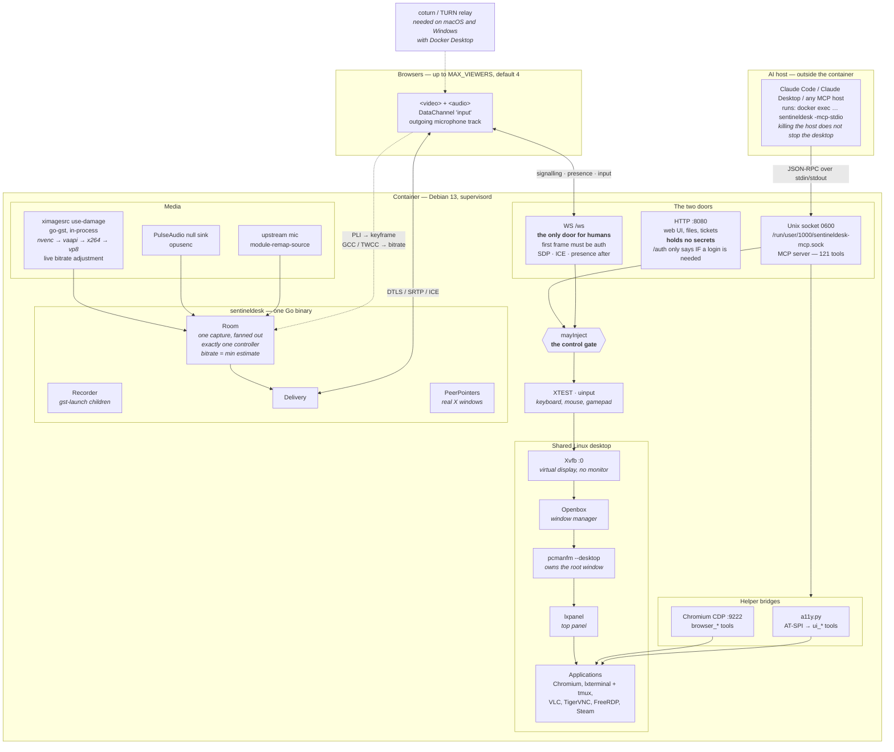

# SentinelDesk architecture

One shared Linux desktop, two independent control planes.

This diagram is the source, not an export of one. It replaced a PNG whose source
was not in this repository, and which by the time anybody checked said the
catalogue held 106 tools and — twice, in the first image of the README — that
room arbitration did not apply to MCP. That second one was not stale, it was
backwards: every tool that drives the desktop passes through the same gate
whichever plane asked for it. A picture nobody can diff says whatever it said on
the day it was drawn, forever.

## The part the old picture got wrong

**Control is claimed, never assumed — by either plane.** Every tool listed in
`injectsInput()` and every tool that changes the shared screen passes through
`mayInject()` before it reaches the desktop, so the agent must hold the controls
first. It never takes them implicitly, not even with the room empty. Releasing
sets the controller to `ControlFree` rather than handing it on, and joining does
not grant it.

Room control and the MCP policy answer different questions. The first is who is
driving right now; the second is what the agent may ever do. To stop an agent
touching anything, the instrument is `-mcp-policy readonly`.

## The two planes

| | humans | the agent |
|---|---|---|
| door | `WS /ws` | Unix socket, mode `0600` |
| first thing | `{type:"auth"}`, and nothing else works until it validates | JSON-RPC `initialize` |
| carries | SDP, ICE, TURN credentials, presence | tool calls |
| input arrives on | a DataChannel named `input` | tool calls that pass the gate |
| survives the other dying | yes | yes — `-mcp-stdio` is a separate process |

HTTP holds no secrets on purpose: ICE configuration and TURN credentials travel
over the authenticated WebSocket, and `/` is served openly because it is an
empty frame that can do nothing until it authenticates.

## What runs in-process and what does not

The **live** pipeline runs inside the Go process — Pion plus go-gst, no
`gst-launch` child. The side pipelines are deliberately children: recording,
screenshots, and the roomless `start_restream` fallback are built from
parameters an agent chooses, they are the ones that can fail on a bad codec
combination or a full disk, and in-process a fault in one of them would take the
daemon down and drop every viewer of a stream that had nothing to do with it.

Same reasoning as `-mcp-stdio` being a separate process: the desktop outlives
whatever went wrong beside it.
